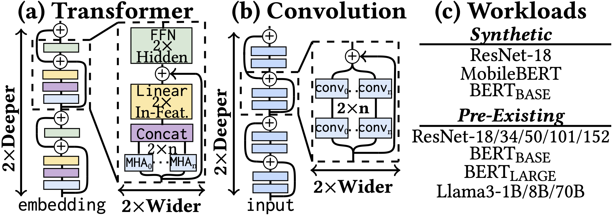
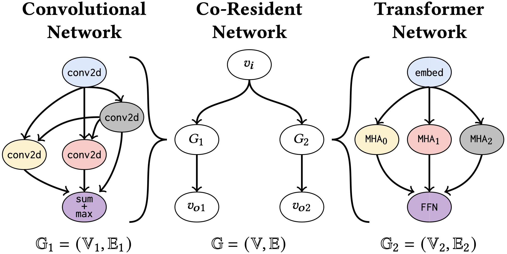

## 1. Workload Definitions

Workloads are stored in the `model_graphs/` directory as `.json` files representing **DAG-structured data-flow graphs**:

- **Nodes** include at least:  
  `name`, `size`, `energy`, `runtime`

- **Edges** include at least:  
  `size`, `energy`, `latency`, `source`, `destination`

Additional JSON fields are allowed yet ignored by MINOS.

## 2. How Workloads Are Derived

To create accurate network representations in terms of **structure**, **energy**, and **runtime**, we parse the PyTorch implementation of an AI/ML model into a **directed acyclic graph** (DAG) using PyTorch’s built-in data-flow graph extractors. In this DAG:

- **Nodes** correspond to individual operators (e.g., convolutions, matmuls, layernorm, ReLU, KV-cache operations).  
- **Edges** represent data dependencies (outputs of one operator as inputs to another).

## 3. Synthetic Model Scaling

To illustrate how the MINOS formulation scales beyond the exact models evaluated in the paper, we include an extended set of experiments on **synthetically scaled workloads**. These experiments mirror common growth patterns in modern AI/ML systems, where successive generations of models expand rapidly in width and depth.
Using the structural regularity of convolutional and transformer networks, we generate enlarged versions of **ResNet-18**, **MobileBERT**, and **BERT**.  
Each “generation” alternates between:

- **Depth scaling** — replication and chaining of existing DFG blocks (e.g., repeating ResNet stages or encoder blocks), excluding special layers such as classifiers.  
- **Width scaling** — proportional duplication of convolution kernels or increased attention head counts, which enlarges projection/output matrices and raises MAC operations accordingly.

This produces controlled exponential growth in compute and memory demand, similar to how real-world models have evolved.

  
   
  <em>Synthetic scaling of (a) Transformers and (b) CNN models. From starting models (c) – Gen. 0 – each Gen. 𝐺, alternates doubling model ‘width’ and ‘depth’; such growing weights models yearly AI/ML parameter growth trends.</em>

## 4. Co-Resident Models and Graph Merging

For **multiple co-resident models** on the same multi-chiplet system, DFGs can be merged into a **single combined graph**, allowing MINOS to optimize joint metrics:

- For models that form a larger application (shared input / merged output), a top-level application graph naturally provides the combined DFG with common input/output nodes.  
- For independent models, a shared “start” node can be introduced to enforce a common start time, enabling joint scheduling under a single optimization problem.

  
   
  <em>Connection of two computational graphs G1 and G2 with common input 𝑣𝑖 but outputs 𝑣𝑜1 and 𝑣𝑜2.</em>

## 5. Adding Custom Workloads

To add your own workload, place a `.json` DAG in `model_graphs/` that follows the node and edge schema above. As long as the required fields are present, MINOS will pick up the graph and integrate it into the optimization flow.

For this, all DFGs are directed acyclic graphs (DAGs) whose:
- **Vertices** represent tensor operators (e.g., convolution, matmul, layernorm, ReLU, caching operations such as KV$).
- **Edges** represent intermediate tensors and data dependencies.
- **Weights** are assumed stationary on the operator’s assigned sub-accelerator.

For each microarchitecture and integration parameter set, annotate the DFG with:
- per-operator **energy**, **execution time**, **capacity**, and **size**
- per-edge **communication energy** and **latency** based on the inter-chiplet parameters and integration choices

Annotations may come from:
- architectural projection or simulation  
- RTL-level simulation  
- parameterized emulation  
- hardware measurements  

Operator fusion (when supported by the microarchitecture) is applied at this stage: fused operators are treated as single vertices with updated annotations. Edges are annotated according to the chosen D2D configuration.

Note that all these values can be scaled individually through our command line interface to adapt to new technology parameters; however, the graph structure remains fixed.