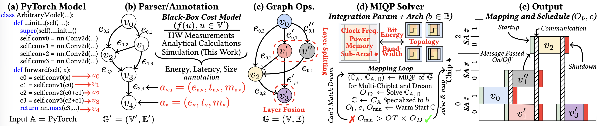
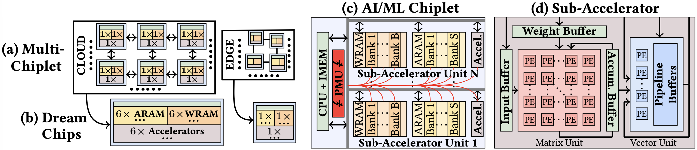

## 1. Optimization Flow

MINOS follows a structured pipeline that transforms model graphs into annotated, normalized, and fully schedulable MIQP instances. 
<p align="center">
  
  <br>
  <em>(a) Inputs are (b) parsed and annotated (e.g., by cycle-accurate RTL simulations, emulation, and/or hardware measurements), followed by (c) graph transformations, culminating in our (d) MIQP solver’s optimized (e) output. Our annotation handles AI/ML models such as CNNs and Transformers.</em>
</p>

### 1.0. Graph Extraction and Annotation
Refer to **[model_graphs/README.md](model_graphs/README.md)**

### 1.1. Graph Pre-processing and Normalization

Before MIQP construction, MINOS:
- removes no-op vertices created by fusion  
- substitutes operators that exceed the smallest available chiplet memory capacity with partitioned, re-annotated sub-operators  
- normalizes **all energies, capacities, and runtimes** to the range \[0, 1\]

Normalization serves two purposes:
1. It yields **unitless annotated graphs** that remain compatible across different architectural scales and configurations.  
2. It reduces the coefficient range of the MIQP constraint matrix, improving numerical stability during solving.

### 1.2. MIQP Construction

MINOS formulates a joint **architecture, mapping, and scheduling MIQP** that determines:
- the assignment of operators to chiplets, memory levels, and sub-accelerators  
- the schedule of computation, communication, and power-gating events  
- wakeup/shutdown behavior under non-ideal power-gating constraints  

The solver returns either:
- a **globally optimal** solution, or  
- a **provably bounded** feasible solution with a certified lower bound on the optimum  

## 2. Code Structure and Execution Path

For users who want to explore or extend the implementation, the optimization pipeline is organized as follows:

- **`partition.py`**  
  Entry point for optimization. Handles argument parsing, loads graphs from `model_graphs/`, configures chiplet networks, pre-processes graphs, manages logging, and orchestrates the complete solve.

- **`partitioner.py`**  
  Core MIQP builder. Instantiates the Gurobi model and connects all constraints and objectives.

- **`constraints.py` / `targets.py`**  
  Contain the mathematical translations of the MIQP formulation into Gurobi primitives. These files correspond directly to the constraint and target definitions discussed in the paper.

- **`network_topologies.py`**  
  Defines inter-chiplet network structures/topologies.

- **`preprocessor.py` / `graph.py`**  
  Normalize the graph, perform operator/edge substitutions, and construct internal graph representations.

- **`problem_rep.py` / `var_rep.py`**  
  Implement memoization and unique model identifiers to support efficient reloading or incremental adjustment across parameter sweeps.

- **`model_adjustment.py`**  
  Allows previously constructed MIQP models to be adapted to new architectural or integration parameters without full rebuild.

- **`util.py`**  
  Provides file interfaces, directory handling, and internal utilities that support the end-to-end workflow.

Upon solving, MINOS performs consistency checks to verify feasibility or, if necessary, runs an infeasibility analysis to identify violated constraints. All relevant outputs are generated automatically, including:
- solution files  
- hardware metrics (energy, latency, throughput, EDP, ET⁻¹)  
- schedule visualizations and timetables  
- partitioned graph views  
- solver metrics such as gap, time, and bound progression  

--- 

To get familiar with this workflow, we recommend starting with a simple execution:

```bash
python partition.py --model resnet18_hybrid
```

## 3. Dream-Chip Evaluation

MINOS uses a theoretical **Dream Chip** as a lower bound for all multi-chiplet designs.

Conceptually, the Dream Chip is an ideal single-die system in which:
- all compute and memory are fully integrated on-chip,
- there is **no inter-chiplet communication**,
- there are **no off-chip memory accesses**, and
- energy is spent almost entirely on active computation (i.e., close to energy-proportional operation).

<p align="center">
  
  <br>
  <em>(a) Homogeneous and heterogeneous multi-chiplet architectures connected by Die-to-Die (D2D) links. (b) A "Dream Chip," built of the same components as the multi-chiplet architecture. (c) AI/ML chiplet with (1) RISC-V CPU + instruction memory (IMEM) to control execution, (2) sub-accelerators (SAs), (3) separate weights (WRAM) and activations (ARAM) memories.</em>
</p>

This makes the Dream Chip a clean reference point to quantify how close a given multi-chiplet configuration comes to the best achievable efficiency for a given workload and target metric (e.g., latency, energy, EDP, ET⁻¹).

To compute this lower bound, you can pass the same arguments you would use for `partition.py` to:

```bash
python dreamer.py
```

## 4. Warm-Starting Heuristics

MINOS includes a broad suite of **warm-start heuristics** that generate diverse candidate mappings and schedules for the MIQP solver. These warm starts significantly accelerate convergence by providing high-quality, feasible starting points and by tightening the solver’s early upper bounds. (See `heuristics.py`)

### 4.1. Warm-Start Strategy

Warm starts are constructed using **fast graph-partitioning algorithms** applied directly to the normalized DAG representation of the workload. The goal is to offer the MIQP solver multiple, structurally distinct solutions spanning different regions of the integer/binary search space.

MINOS implements a large family of such heuristics, including:

- **Community-based methods:** Louvain, Walktrap, Significance, Surprise, CPM, RBER-Potts  
- **Spectral / embedding-based approaches:** spectral clustering, K-Means embeddings  
- **Greedy variants:** fill-first, throughput-aware, communication-cost-aware, greedy-with-lookahead, greedy merging  
- **Topology-guided placements:** ASAP-latency bias, topological order, layered mapping, DFS-based assignment  
- **Edge-centric strategies:** maximizing intra-chip adjacency  
- **Load-balancing methods:** max-load and balanced partitions

### 4.2. From Partitioning to Schedules

After partitioning operators into communities, MINOS packs these communities onto chiplets subject to:

- chiplet memory capacity  
- available sub-accelerators (SAs)  
- communication costs  
- power-gating constraints

Each resulting partition is then transformed into a **full ASAP / load-balancing schedule**, incorporating inter-chiplet hop delays and edge latencies.

From this schedule, MINOS materializes all MIQP start values, including:

- chiplet and SA assignments  
- node start and finish times  
- per-SA loads  
- max-load targets  
- cluster mappings and usage indicators  
- cluster start/end times  
- idle and wakeup variables  
- (resource summaries (compute load, memory banks)) 
- (the corresponding SA×Memory chiplet $-cost pair)

This pipeline yields multiple warm starts per run, allowing the solver to explore complementary basins of the search space while respecting all architectural constraints.

### 4.3. Memoized Solutions

In addition to heuristic warm starts, MINOS can **warm-start from previous MIQP solutions**.  
This includes:

- identical architectures and integration parameters  
- slightly modified configurations (e.g., running a new MIQP with faster D2D links)  
- parameter sweeps during design-space exploration

As long as hardware constraints remain satisfied, memoized material can accelerate convergence dramatically. Each of these elements is exposed programmatically within MINOS, and users are encouraged to enable warm starts by default to benefit from these improvements.

### 4.4. Classes of Heuristics

#### 4.4.1. Community-Based Heuristics

- **Reichardt–Bornholdt Potts** (Reichardt & Bornholdt, 2006)
- **Clique Percolation Method (CPM)** (Traag, Van Dooren & Nesterov, 2011)
- **Surprise Communities** (Traag, Aldecoa & Delvenne, 2015)
- **Significance Communities** (Traag, Krings & Van Dooren, 2013)
- **Louvain Method** (Blondel et al., 2008)
- **Greedy Modularity Maximization** (Clauset, Newman & Moore, 2004)
- **Label Propagation** (Cordasco & Gargano, 2010)
- **Fluid Communities** (Parés et al., 2017)
- **Walktrap Algorithm** (Pons & Latapy, 2005)
- **Paris Hierarchical Clustering** (Bonald et al., 2018)
- **Expectation–Maximization Clustering** (Newman & Leicht, 2007)
- **Diffusion Entropy Reducer** (Kozdoba & Mannor, 2015)
- **Markov Clustering (MCL)** (Enright, Van Dongen & Ouzounis, 2002)
- **Girvan–Newman Algorithm** (Girvan & Newman, 2002)
- **Edge Current-Flow Betweenness** (Fortunato, 2010)
- **Edge Betweenness Partitioning** (Fortunato, 2010)
- **Siblinarity Antichain Communities** (Vasiliauskaite & Evans, 2020)
- **Belief Propagation Clustering** (Zhang & Moore, 2014)
- **GDMP2 – Greedy Dense Subgraph Discovery** (Chen & Saad, 2012)

#### 4.4.2. Spectral & Embedding-Based Heuristics

- **Spectral Clustering** (Higham, Kalna & Kibble, 2007)
- **K-Means (graph embeddings)** — classical clustering on low-dimensional embeddings

#### 4.4.3. Greedy Heuristics

- Fill-first assignment
- Cost-aware greedy assignment using communication estimates
- Greedy with lookahead
- Greedy with community merging

#### 4.4.4. Topology-Guided Heuristics

- Topological order mapping
- Layered graph assignment
- Depth-first scheduling and placement
- Edge-centric adjacency maximization

#### 4.4.5. Load-Balancing Heuristics

- Max-load balancing
- Balanced SA-utilization approaches

## 5. References
- Vincent A Traag, Paul Van Dooren, and Yurii Nesterov. 2011. Narrow scope for resolution-limit-free community detection. Physical Review E—Statistical, Nonlinear, and Soft Matter Physics, 84, 1, 016114.
- Vincent A Traag, Rodrigo Aldecoa, and J-C Delvenne. 2015. Detecting communities using asymptotical surprise. Physical review e, 92, 2, 022816.
- Vincent A Traag, Gautier Krings, and Paul Van Dooren. 2013. Significant scales in community structure. Scientific reports, 3, 1, 2930.
- Vincent D Blondel, Jean-Loup Guillaume, Renaud Lambiotte, and Etienne Lefebvre. 2008. Fast unfolding of communities in large networks. Journal of statistical mechanics: theory and experiment, 2008, 10, P10008.
- Desmond J Higham, Gabriela Kalna, and Milla Kibble. 2007. Spectral clustering and its use in bioinformatics. Journal of computational and applied mathematics, 204, 1, 25–37.
- Aaron Clauset, Mark EJ Newman, and Cristopher Moore. 2004. Finding community structure in very large networks. Physical Review E—Statistical, Nonlinear, and Soft Matter Physics, 70, 6, 066111.
- Gennaro Cordasco and Luisa Gargano. 2010. Community detection via semi-synchronous label propagation algorithms. In 2010 IEEE international workshop on: business applications of social network analysis (BASNA). IEEE, 1–8.
- Ferran Parés, Dario Garcia Gasulla, Armand Vilalta, Jonatan Moreno, Eduard Ayguadé, Jesús Labarta, Ulises Cortés, and Toyotaro Suzumura. 2017. Fluid communities: a competitive, scalable and diverse community detection algorithm. In International conference on complex networks and their applications. Springer, 229–240.
- Pascal Pons and Matthieu Latapy. 2005. Computing communities in large networks using random walks. In International symposium on computer and information sciences. Springer, 284–293.
- Thomas Bonald, Bertrand Charpentier, Alexis Galland, and Alexandre Hollocou. 2018. Hierarchical graph clustering using node pair sampling. arXiv preprint arXiv:1806.01664.
- Mark EJ Newman and Elizabeth A Leicht. 2007. Mixture models and exploratory analysis in networks. Proceedings of the National Academy of Sciences, 104, 23, 9564–9569.
- Mark Kozdoba and Shie Mannor. 2015. Community detection via measure space embedding. Advances in neural information processing systems, 28.
- Anton J Enright, Stijn Van Dongen, and Christos A Ouzounis. 2002. An efficient algorithm for large-scale detection of protein families. Nucleic acids research, 30, 7, 1575–1584.
- Michelle Girvan and Mark EJ Newman. 2002. Community struc-
ture in social and biological networks. Proceedings of the national academy of sciences, 99, 12, 7821–7826.
- Santo Fortunato. 2010. Community detection in graphs. Physics reports, 486, 3-5, 75–174.
- Vaiva Vasiliauskaite and Tim S Evans. 2020. Making communities show respect for order. Applied Network Science, 5, 1, 15.
- Pan Zhang and Cristopher Moore. 2014. Scalable detection of statistically significant communities and hierarchies, using message
- Chen, Jie, and Yousef Saad. Dense subgraph extraction with application to community detection. IEEE Transactions on Knowledge and Data Engineering 24.7 (2012): 1216-1230.