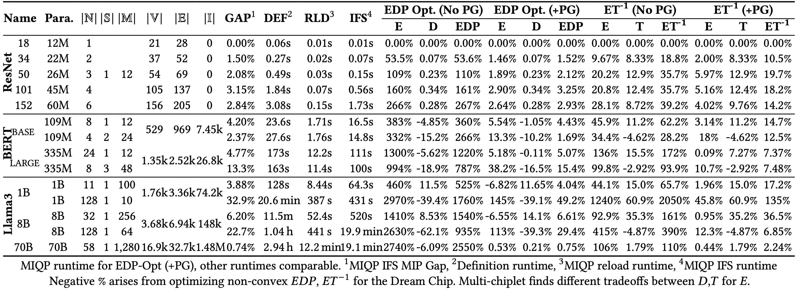
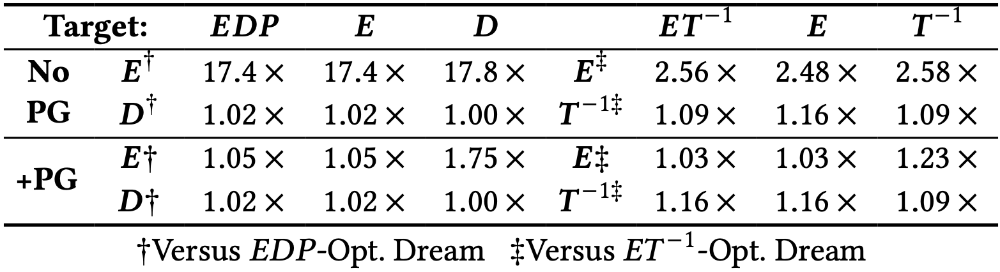
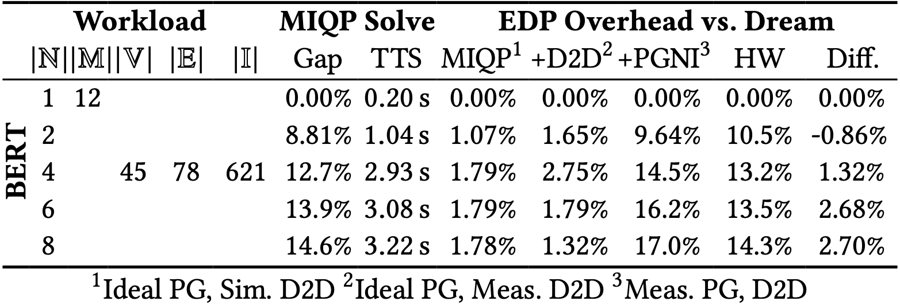
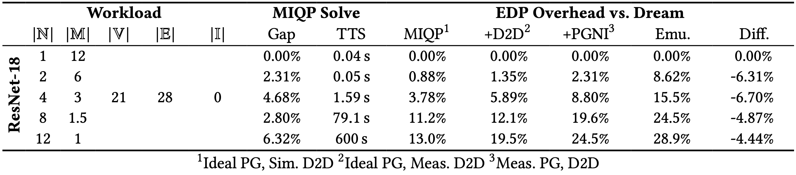
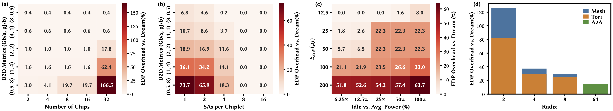
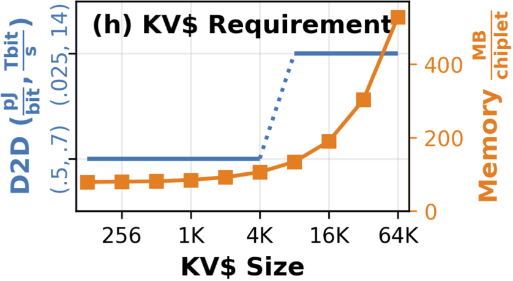
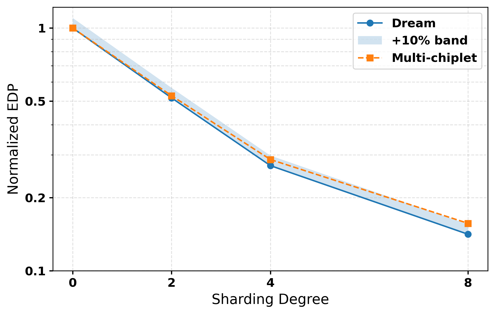
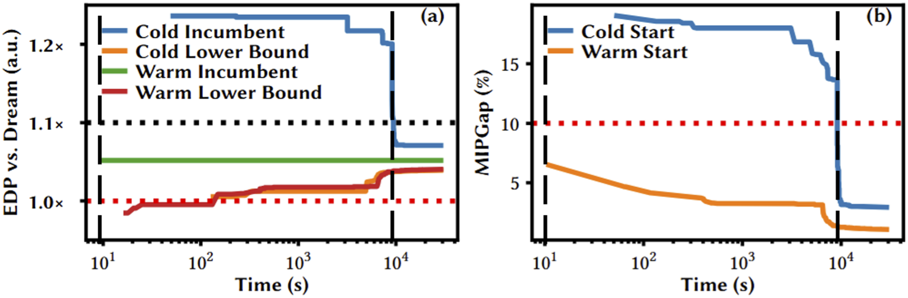
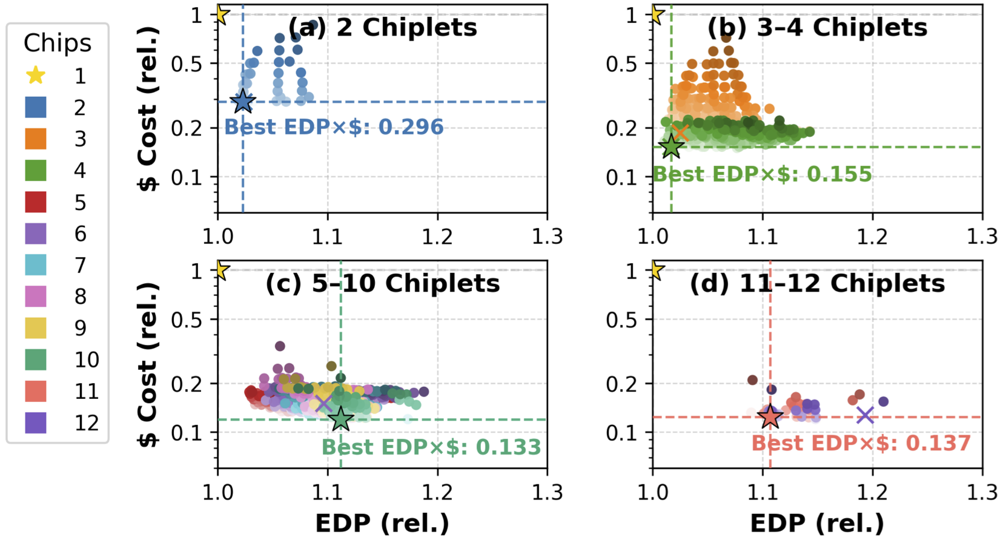

## 0. Determinism Disclaimer

Gurobi’s optimization process is **not guaranteed to be fully deterministic** across different machines, operating systems, CPU architectures, or Gurobi versions. Slight variations can occur due to floating-point effects, presolve choices, and parallel execution. When re-running the experiments, you should **therefore not expect identical** objective values, gaps, or runtimes. In practice, runs on different machines have produced slightly different numbers but **consistent trendlines** and architectural conclusions. The scripts in this repository are intended to reproduce the same qualitative behavior and comparisons as reported in the paper, even if individual data points differ within a reasonable range.

## 1. Reproducing Core Optimization Results

### 1.1. Model Comparison (Table 4a)
**`model_comparison.py`**  
This script evaluates a range of workloads under both **EDP** and **ET⁻¹** optimization targets. For each workload, it compares the optimized multi-chiplet architecture against the corresponding **Dream-Chip lower bound** and logs all results into a CSV file for further analysis.

This experiment demonstrates several core properties of MINOS:
- **Near-Dream optimality across diverse models.**  
  For all AI/ML workloads evaluated, MINOS finds **provably optimal or tightly bounded** solutions **within minutes**.  

- **Large improvements over traditional pipelining methods.**  
  Compared to conventional latency- or throughput-oriented approaches, MINOS provides extensive EDP/ET⁻¹ improvements achieved by jointly optimizing placement, communication, and fine-grained power behavior.

- **Scalability to large architectural configurations.**  
  The experiment covers designs with:  
  - **up to 128 chiplets and sub-accelerators**,  
  - **D2D links from 4 Gbit/s and 1 pJ/bit**,  
  - **power-gating overheads of 50 µJ and 25 µs**, and  
  - chiplet memory capacities ranging from **12 MB to 1.3 GB**.  

Run via:
```bash
python model_comparison.py
```

<p align="center">
  
  <br>
  <em>Comparison of models and corresponding MIQP-found overheads versus the Dream Chip.</em>
</p>

---

### 1.2. Synthetic Scaling Evaluation 
**`scaling_comparison.py`**  
This script evaluates synthetically scaled variants of ResNet-18, MobileBERT, and BERT. It highlights how solver runtime and memory usage correlate with DFG structure — specifically the product of **|V| × |E|** and the number of incomparable node pairs **|I|**, which drive ordering constraints.

- Runtime is dominated by graph structure, not parameter count.  
- Exponential model growth can be offset through **linear increases** in on-chip memory, link bandwidth, and link energy efficiency.  
- The **memoization** pathway substantially reduces MIQP setup time and amortizes across multiple analyses.  
- Even at large scales, the heuristics yield high-quality solutions in short time.

Run via:
```bash
python scaling_comparison.py
```

<p align="center">
  
  <br>
  <em>Architectures maintaining energy-efficiency for growing ResNet-18 workloads and MIQP computational scalability.</em>
</p>

<p align="center">
  
  <br>
  <em>Architectures maintaining energy-efficiency for growing MobileBERT workloads and MIQP computational scalability.</em>
</p>

<p align="center">
  
  <br>
  <em>Architectures maintaining energy-efficiency for growing BERTBASE workloads and MIQP computational scalability.</em>
</p>

---

### 1.3. Target-Aware Optimization (Table 4b)
**`target_comparison.py`**  
This script evaluates how different optimization targets behave for Llama3-1B, both **with** and **without** fine-grained power gating.

- **Optimizing purely for delay (e.g., ET⁻¹) without considering energy leads to substantially higher energy use.**  
  This demonstrates the importance of **energy-aware multi-chiplet optimization**, especially for large models and edge-relevant deployments.
- **Power gating dramatically changes the tradeoff landscape.**  
  When power gating is *disabled*, energy remains consistently high. This spread reflects true design tradeoffs that are otherwise masked when idle units cannot be shut down.
- **Multi-objective metrics (EDP, ET⁻¹) reflect these tradeoffs transparently.**  
  Power gating allows EDP-optimized schedules to maintain near-Dream efficiency while balancing runtime, whereas ET⁻¹ targets emphasize throughput at the cost of moderately increased energy consumption.

Run via:
```bash
python target_comparison.py
```

<p align="center">
  
  <br>
  <em>Optimization target impact for Llama3-1B.</em>
</p>

---

### 1.4. Sub-Accelerator Scaling (Table 4c)
**`pe_scaling.py`**  
This experiment evaluates how optimization quality and solver behavior scale across different **sub-accelerator (SA)** and **processing-element (PE)** designs. For each SA configuration, the underlying DFG is **re-annotated via architectural simulation**, ensuring accurate per-operator latency, energy, and memory usage before solving.

- **Broad architectural coverage.**  
  The MIQP supports design-space exploration across SA arrays ranging from **8×8 to 128×128 PEs**, and on-chiplet memory bandwidths spanning **0.1 TB/s to 1.5 TB/s** — covering both edge-class accelerators and large cloud-scale configurations.
- **Interconnect improvements become necessary.**  
  As SA compute efficiency improves, **inter-chiplet bandwidth and energy must improve proportionally** to avoid becoming bottlenecks. Yet, even in the most demanding configurations, these requirements remain **within modern UCIe capability ranges**.
  
Run via:
```bash
python pe_scaling.py
```

<p align="center">
  
  <br>
  <em>Varying SAs: Llama3-1B EDP Overheads vs. Dream.</em>
</p>

---

### 1.5. Hardware Validation (Figure 5)
**`hardware_comparison.py`**
This script evaluates a progressively deepened **BERT encoder** across increasing chiplet counts under the same non-idealities used in the hardware implementation (interconnect costs, wakeup/shutdown overheads, leakage behavior). 

- **High-fidelity modeling.**  
  After calibrating the wakeup and shutdown parameters (ESW, TSW) to the measured system, MINOS predictions closely match the hardware across 1–8 chiplets.  
- **Hardware characteristics.**  
  The validation platform is a homogeneous multi-chiplet system fabricated in **TSMC N40 ULP CMOS** with **RRAM-based on-chip memory**. RRAM’s non-volatility enables fast and energy-efficient fine-grained power gating, complementing the architectural assumptions used in MINOS. Each chiplet integrates:
  - a 16×16 8-bit matrix unit and a 16-lane vector unit  
  - a RISC-V control core  
  - **12 MB RRAM** for weights and **2 MB SRAM** for activations  
  - four 16b-wide D2D links  
  - a 128b NoC  
  - sub-5 µs compute-/memory-block wakeup and <24 µs chiplet-level wakeup  
- **Measurement methodology.**  
  Energy and latency were measured using:
  - on-board power monitors  
  - repeated execution of compute clusters  
  - JTAG-based configuration  
  - integrated cycle counters for timing  

Run via: 
```bash
python hardware_comparison.py
```

<p align="center">
  
  <br>
  <em>Multi-chiplet hardware measurement vs. MIQP.</em>
</p>

---

### 1.6. Emulation Validation  
**`emulation_comparison.py`**  
This script benchmarks **ResNet-18** across multiple chiplet counts using a cycle-accurate emulation environment, and compares the resulting execution traces against MINOS’s MIQP-predicted energy and latency. It is validated using a full **RTL-level emulation flow** of the multi-chiplet system implemented on **Cadence Palladium**.  
The emulation model includes:
- bit-parallel D2D GPIO interfaces matching the hardware link protocols  
- the full multi-chiplet compute pipeline (accelerator cores, SRAM/RRAM interactions, and NoC behavior)  
- a system-level testbench capable of loading model weights/activations into each chiplet  
- cycle counters for per-chiplet and end-to-end timing measurement  

Run via: 
```bash
python emulation_comparison.py
```

<p align="center">
  
  <br>
  <em>Multi-chiplet cycle-accurate emulation compared to MIQP results.</em>
</p>

---

### 1.7. Architectural Derivations and Ablations (Figure 4a–c)

Each MIQP is built once, cached, and then only the affected constraints are updated when exploring new architectural parameters. Combined with heuristic warm starts and Dream-Chip–based lower bounds, this makes large multi-dimensional design-space sweeps tractable.
Without memoization and warm starts, full design-space evaluations (like those in Figure 5) would take:
- **>4.2 days** for BERT  
- effectively **impossible** for Llama-scale models

<p align="center">
  
  <br>
  <em>Ablation studies for BERT (109M params): (a) Increasing chiplet count and (b) SAs per chiplet (iso- total memory
and compute capacity) versus improving D2D links. (c) SA idle power as % of average SA power versus round-trip shutdown +
wakeup energy for 8 chiplets. (d) D2D radix and topology for 64 chiplets.</em>
</p>

#### 1.7.1. Chiplet Scaling (Figure 4a)
**`chip_scaling_heatmap.py`**  
Reproduces **Figure 5a**, examining how scaling the **number of chiplets** affects efficiency and cost relative to the Dream Chip.

- **Chiplets alone do not close the gap to the Dream-Chip.**  
  Simply increasing chiplet count, without improving interconnects or memory, fails to reduce overheads. 
- **Interconnect quality must scale with chiplet count.**  
  Moving to higher chiplet counts requires **faster D2D bandwidth** and **lower D2D energy** to avoid large penalties. Without such improvements, multi-chiplet designs experience significant EDP increases compared to the Dream-Chip baseline.

Run via: 
```bash
python chip_scaling_heatmap.py
```

#### 1.7.2. Sub-Accelerator Parallelism (Figure 4b)
**`subacc_d2d_heatmap.py`**  
Reproduces **Figure 5b**, studying how increasing **per-chiplet parallelism** (more sub-accelerators per chip) compares to spreading parallelism across more chiplets.

- **Per-chip parallelism is often preferable.**  
  Increasing the number of SAs **within a chiplet** allows more work to be done locally, avoiding expensive cross-chip communication and maximizing utilization of local memory bandwidth.
- **Power gating interacts with SA usage.**  
  Each additional active SA incurs **shutdown–wakeup energy (ESW)** when power gating is used. This means there is a real energy cost to “turning on” lots of parallel SAs, especially if they are not well utilized.

Run via: 
```bash
python subacc_d2d_heatmap.py
```

#### 1.7.3. Power-Management Ablation (Figure 4c)
**`id_wcs_heatmap.py`**  
Reproduces **Figure 5c**, which explores the trade-off between **idle power** and **wakeup cost**, and identifies when fine-grained power gating is most effective.

- **High idle power quickly degrades EDP.**  
  When per-chiplet idle power \(P\_I\) grows large relative to average compute power (e.g., due to high static or leakage power), total EDP increases quickly.
- **Improved power-gating granularity removes much of this overhead.**  
  With more fine-grained power gating, the EDP penalties from higher idle powers can be effectively mitigated.

Run via: 
```bash
python id_wcs_heatmap.py
```
#### 1.7.4. Network Topology Ablation  
**`topology_overhead.py`**  
This script compares different **D2D network topologies and radices**, quantifying how link fan-out impacts EDP relative to the Dream Chip.

- **Higher radix helps, but quickly saturates.**  
  Increasing D2D radix reduces overhead versus the Dream-Chip baseline, but gains flatten beyond **2D-torus–like** topologies.  
- **Improving link quality beats adding more links.**  
  Enhancing **D2D energy per bit (D2D_E)** and **D2D bandwidth (D2D_BW)** is generally more impactful than increasing the number of links per die.

Run via: 
```bash
python topology_overhead.py
```

---

### 1.8. KV-Cache Scaling  
**`kv_scaling.py`**  
This experiment evaluates how **growing KV-cache (KV$) sizes** impact multi-chiplet design, focusing on the point at which KV and attention operations can no longer remain co-located on a single chiplet.

- **Near-Dream designs are possible with and without KV-cache.**  
  MINOS finds multi-chiplet architectures that stay close to the Dream-Chip bound for a range of KV-cache sizes and memory types.
- **When KV-cache dominates total capacity, things change.**  
  Once KV$ becomes the primary consumer of memory, it often must be **separated from its corresponding attention heads** across chiplets.  
  This forced separation drives **higher D2D requirements** to sustain similar efficiency.
- **Staying near Dream requires coordinated scaling.**  
  As KV$ size grows, maintaining **EDP overhead vs. Dream** requires:
  - increased **on-chip capacity** to keep more KV local  
  - **step-wise improvements in D2D bandwidth and energy** whenever KV no longer fits on a single chiplet

Run via: 
```bash
python kv_scaling.py
```

<p align="center">
  
  <br>
  <em>The inflection point where key-value caches (KV$) must be partitioned across chiplets introduces large D2D demand.</em>
</p>

---

### 1.9. Tensor-Parallel Sharding Behavior
**`sharding.py`**  
This script evaluates synthetic **tensor-parallel sharding** of matmul operators across sharding degrees **0, 2, 4, 8**. While MINOS does **not** directly optimize tensor-parallel sharding in the MIQP, this experiment shows that:

- EDP scaling closely follows the **idealized sharding behavior**.
- With sufficiently strong D2D links, all sharding degrees remain **well within Dream-Chip bounds**.
- Results are written to a CSV with:
  - **ShardingDegree**
  - **EDP** (energy × latency)
  - **FactorToPrevious** (relative EDP change vs. the next-smaller sharding degree)

Run via:
```bash
python sharding.py
```

<p align="center">
  
  <br>
  <em>Near-Ideal Scaling With Dream-Level Efficiency Across Sharding Degrees</em>
</p>

---

### 1.10. Heuristic Speedup and Solver Behavior
**`heuristic_speedup.py`**  
Quantifies the difference between naive Gurobi optimization and MINOS warm-start heuristics.

Warm starts yield feasible solutions in fractions of a second, while naive optimization may take minutes. Equally important to warm starts are the **lower bounds** used by MINOS, which tighten the feasible search space and certify the quality of the final result. These bounds originate from the **Dream-Chip abstraction**, which by definition yields the best-achievable performance for a given workload. These bounds are used internally to reduce solver effort, prune infeasible regions early, and provide tight certificates on solution quality.

In practice, combining:
- heuristic warm starts  
- memoized MIQP solutions  
- Dream-Chip–based lower bounds  
- early termination
yields substantial speedups. Even for moderately sized workloads (e.g., a 4×-scaled ResNet-18), warm starts can enable nearly immediate solver termination, achieving speedups of more than **three orders of magnitude** compared to naïve solving. 

Run via: 
```bash
python heuristic_speedup.py
```

<p align="center">
  
  <br>
  <em>Solver speedup using our Dream Chip memoization, heuristic warm starting, and Dream Chip target early termination. ResNet-18 scaled 4×.</em>
</p>

## 2. Cost Modeling Experiments
Chiplet-based architectures emerge not only from performance considerations but also from their potential for favorable cost structures, especially when compared to large monolithic designs. We provide the analyses behind the cost-focused results in the paper, combining performance metrics with estimated manufacturing cost models.

### 2.1. Heterogeneous Cost Sweep (Figure 4d)
**`hetero_cost_sweep.py`**  
This script performs a broad design-space sweep across **heterogeneous chiplet configurations**, evaluating a joint **EDP × $ cost** objective.  
The experiment employs a flexible cost model, which parameterizes cost at both the **sub-accelerator (SA) level** and the **memory-bank level**, allowing realistic modeling of heterogeneous SoC-style multi-chiplet assemblies.

The MIQP formulation incorporates per-chip cost lookup tables that account for die size, memory configuration, SA count, packaging overheads, and yield-related losses. Using these dynamic cost variables, the solver explores thousands of candidate configurations and selects the architecture that jointly minimizes **EDP** and **package-level $ cost**.

Across the sweep, several patterns emerge:
- Mildly heterogeneous systems can achieve **slightly better EDP × $** tradeoffs, but the benefit is small. Fully heterogeneous designs offer **only ~20.3% cost reduction** and exhibit **~4.8% EDP overhead**, which is typically too small to justify the additional design complexity.
- Extremely unbalanced or strongly heterogeneous chiplet sets generally perform poorly due to resource imbalance and fragmented memory layouts. Too few chiplets resemble single-large-die designs and therefore incur high $ costs; too many chiplets incur large EDP penalties and minimal marginal cost benefit.

Run via: 
```bash
python hetero_cost_sweep.py
```

<p align="center">
  
  <br>
  <em>We evaluate over 2,700 possible 12-SA, multi-chiplet designs with >64 MB-per-SA.</em>
</p>

---

### 2.2. Homogeneous Cost Scaling
**`homo_cost_scaling.py`**  
This script evaluates homogeneous chiplet configurations across a range of chiplet counts, revealing a characteristic **U-shaped profile** when plotting EDP × $:

- **Low chiplet counts**:  
  High cost but very strong EDP efficiency due to minimized communication overhead.
- **High chiplet counts**:  
  Lower manufacturing cost per chiplet, but increasing communication requirements cause EDP degradation.

Run via: 
```bash
python homo_cost_scaling.py
```

<p align="center">
  
  <br>
  <em>Too many chiplets results in high 𝐸𝐷𝑃×$ costs. </em>
</p>
